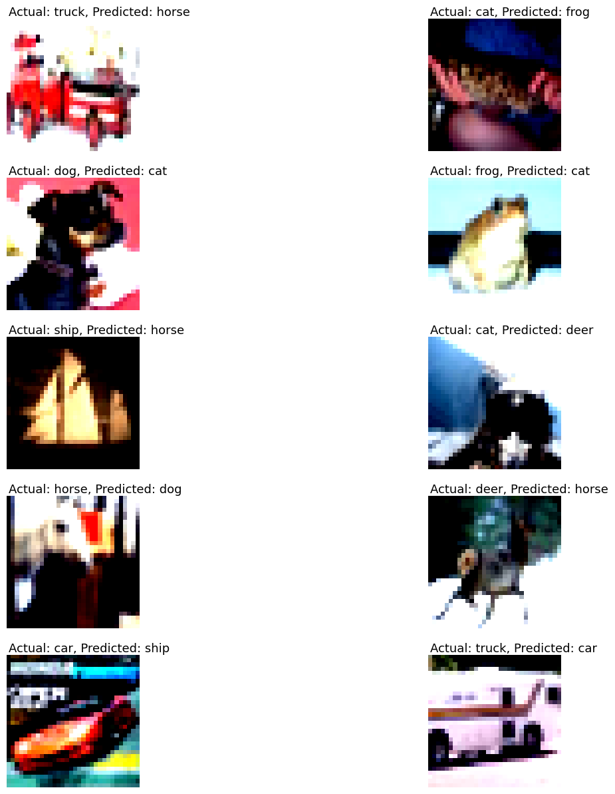

# Code Overview
This repository contains code for three different convolutional neural network (CNN) architectures implemented in PyTorch for image classification tasks on the CIFAR-10 dataset. Each network employs a different normalization technique: Group Normalization, Layer Normalization, and Batch Normalization.

**1) Network with Group Normalization**
Group Normalization divides the channels into groups and computes normalization within each group independently.

**2) Network with Layer Normalization**
Layer Normalization computes normalization within each channel independently across all spatial locations.

**3) Network with Batch Normalization**
Batch Normalization computes normalization within each channel independently but across the entire batch of data.

# Findings
After training and evaluating each network, the following findings were observed:

**Group Normalization:** Showed competitive performance compared to Batch Normalization and Layer Normalization, especially on smaller batch sizes. It demonstrated robustness to changes in batch size.

**Layer Normalization:** Although less commonly used in CNNs, Layer Normalization showed decent performance but was slightly outperformed by Group Normalization and Batch Normalization in terms of convergence speed.

**Batch Normalization:** Showed consistent performance and fast convergence, especially on larger batch sizes. However, it exhibited sensitivity to batch size changes and might not generalize well to different batch sizes.

# Misclassified Images

